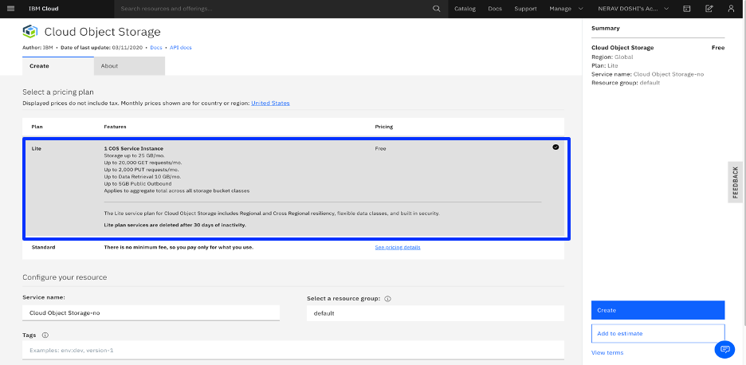
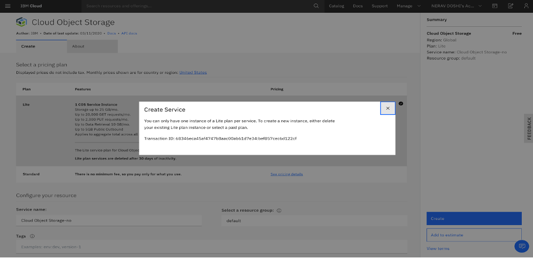
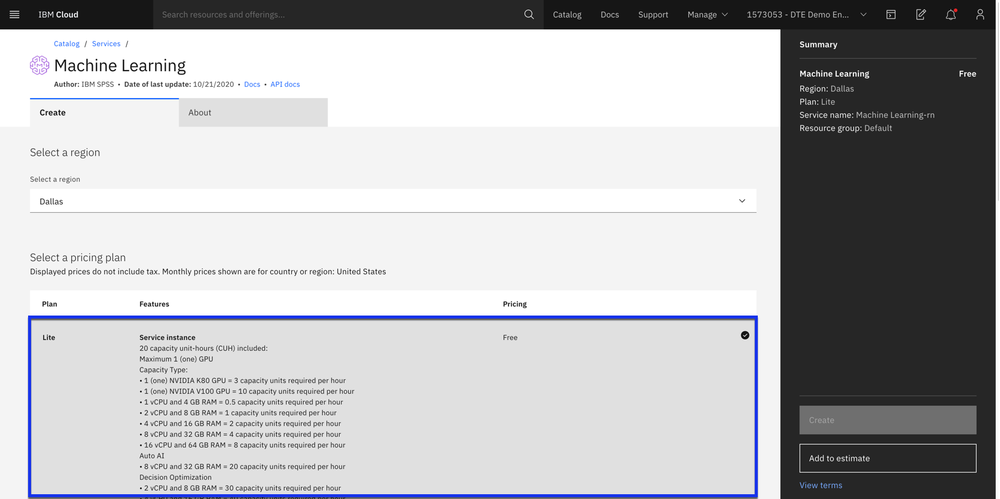

### 1. Create Watson Studio service on IBM Cloud

The first step is to set up your IBM Cloud [Watson Studio service](https://cloud.ibm.com/catalog/services/watson-studio). See the video below to help you create your free
IBM Watson Studio service.

* After logging into IBM Cloud, click `Proceed` to show that you have read your data rights.

* Click on `IBM Cloud` in the top left corner to ensure you are on the home page.

* Within your IBM Cloud account, click on the top search bar to search for cloud services and offerings. Type in `Watson Studio` and then click on `Watson Studio` under `Catalog Results`.

* This takes you to the Watson Studio service page. There you can name the service as you wish. For example, one may name it
`Watson-Studio-trial`. You can also choose which data center to create your instance in. The gif above shows mine as
being created in Dallas.

* For this guide, you choose the `Lite` service, which is no-charge. This has limited compute; it is enough
to understand the main functionality of the service.

* Once you are satisfied with your service name, and location, and plan, click on create in the bottom-right corner. This creates your Watson Studio instance.

### 2. Create Cloud Object Storage service
To store the data, you need a storage service to be linked with your project later. To do that, search for Storage in the IBM Cloud Catalog or go to the Storage tab from the left menu on the same page and click the Object Storage service.

The lite plan gives you only 1 service. If you get this message that means you already have a service and can use that. If you get the following message, then you already have 1 service in your account.

### 3. Create a Machine Learning Service
You will also need to provision Watson Machine Learning:
Open Catalog from top of the page.Under Search type “Machine Learning” and select the Lite plan

