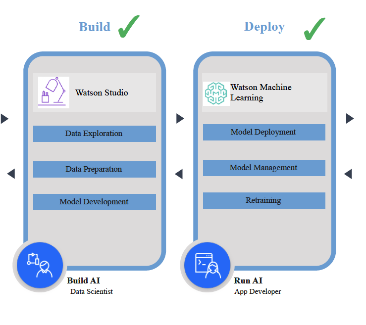

# IBM-Decison-Optimization-Workforce-Scheduling
Create an workforce schedule for warehouse operations

UseCase: Major Brands International (MBI) is a global organization which operates consumer electronics retail stores under the name of "SmarterElectronics" in a number of major cities around the world.  In the past few years the growth trajectory of MBI has been very good and as a result the number of employees has increased significantly. 
Like many companies, the global pandemic has had a major impact on MBI's performance. Initially, the large increase in online orders delivered excellent revenue for the company, and customer satisfaction was high. However, recently shipping times have increased, causing more orders to miss their promised delivery dates. Further investigation has revealed high employee turnover in the warehouse division, which is negatively impacting shipping times.

# Tools
**Watson Studio (WS)** is a comprehensive data science workbench. It is used to prepare and builds models with your choice of tool and run times. You can build models using open source codes or visual modeling.

**Watson Machine Learning (WML)** is a platform for deploying models. It supports deployment of AutoAI, SPSS, Decision optimization as well as open source models.

WS and WML support the entire machine learning lifecycle, which we will demonstrate in this lab

# Learning Objectives

* Develop a Decision Optimization model using natural language modeling assistant
* Review and compare scenarios based on KPI metrics
* Deploy the Decision Optimization model into Watson Machine Learning
* Schedule Jobs using Deployment Space

Predictive model using AutoAI - [Evaluate, retrain and redeploy models with IBM Cloud Pak for Data](https://ibm.box.com/s/jvcb7p97vy6xc724vsf0w0nczzo8fcb4)

Tutorial1 - [In this tutorial, objective is to optimize staffing  based on employee safety, skill levels, and cost](Tutorial1/Decision_Optimization_tutorial_readme.md)

Tutorial2 - [Here we save optimization model for deployment, promote it to deployment space and create a deployment job with assets added to space ](Tutorial2/Deploy_readme.md)
