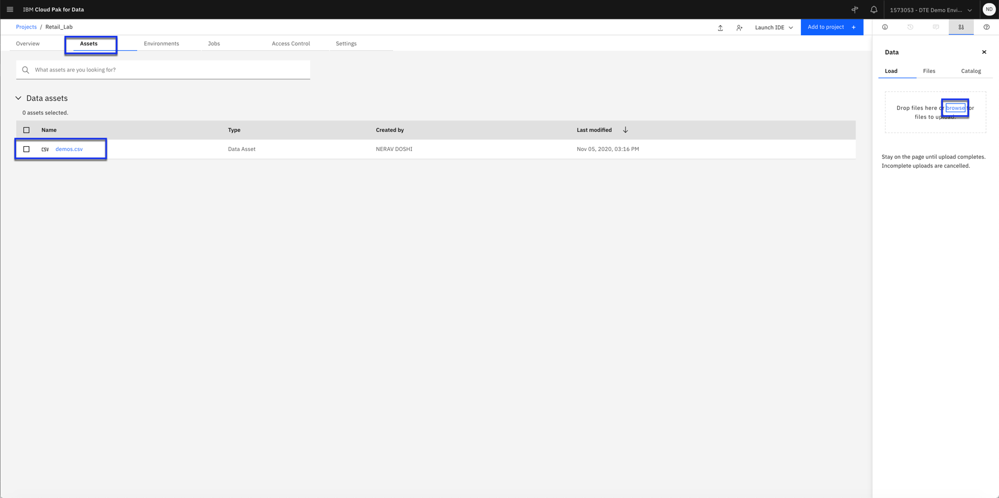

# Create Decision optimization model

 Start to develop an optimization model.

 Decision Optimization experiment to build an optimization to select the promotions by store locations. The overall objective would be to maximize predicted sales and minimize promotion cost with budget limitations.

 Watson Studio is an integrated platform designed to organize your project assets, like data sets, collaborators, models, notebooks. You are going to use Watson Studio to create a project in which you train a model with AutoAI and deploy this trained model.

### Step 1. Create a Watson Studio project (Skip this step if a project is already created from previous labs)
 - Click Create a Project.
 - Select Create an empty project.
 - Name your project Example: *EmployeeAnalysis* If you have a Cloud Lite account, the Object Storage service you created in the previous step will be selected automatically.Otherwise, select a service from the drop-down menu and Click Create.

 

### Step 2. Add data to the project
 - Click the Assets tab. The right-side window shows a load tab.
 - Click the browse link and select the *Employee.csv, Shift.csv and Staff.csv* file from the [data folder].
 - Click Open and the file is uploaded in cloud object storage

 

 Click demos.csv under Data assets. You can preview the first 1000 rows and all the columns for historical promotion data. Scroll on the right to look at all the columns. This is historical promotion dataset by store location
 where the increase denotes the historical percentage increase in customer demand when there was any promotion. Click the Retail_lab on the top to go back to the project.
