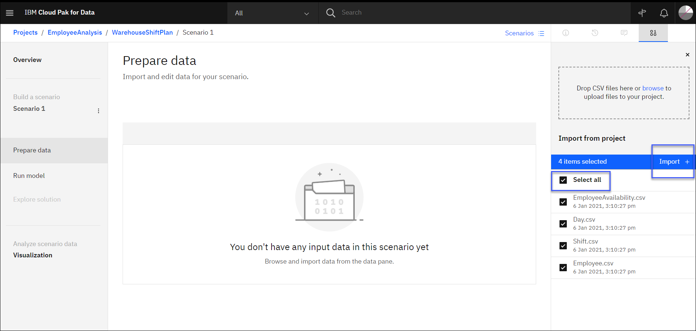

# Create Decision optimization model

 Start to develop an optimization model.

 Decision Optimization experiment to build an optimization to select the promotions by store locations. The overall objective would be to maximize predicted sales and minimize promotion cost with budget limitations.

 Watson Studio is an integrated platform designed to organize your project assets, like data sets, collaborators, models, notebooks. You are going to use Watson Studio to create a project in which you train a model with AutoAI and deploy this trained model.

### Step 1. Create a Watson Studio project (Skip this step if a project is already created from previous labs)
 - Click Create a Project.
 - Select Create an empty project.
 - Name your project Example: *EmployeeAnalysis* If you have a Cloud Lite account, the Object Storage service you created in the previous step will be selected automatically.Otherwise, select a service from the drop-down menu and Click Create.

 

### Step 2. Add data to the project
 - Click the Assets tab. The right-side window shows a load tab.
 - Click the browse link and select the *Employee.csv, EmployeeAvailability.csv Shift.csv and Day.csv* file from the [data folder].
 - Click Open and the file is uploaded in cloud object storage

 

 Click **Employee.csv** under Data assets and you can preview the dataset.
 __Input Data__

 **employeeId**	- employee id

 **pay rate**	- employee hourly pay

 **skills** - ability of employee to staff departments. Each employee can have multiple skillset to staff departments

 **senority**	- identifies employees with seniority levels based on years of service and qualifications. This column can be used to assign constraints.For this use case we will not be using this column.

 **qualification** - employee qualification to do the job. This column can be used to assign constraints. For this use case we will not be using this column.

  Click **Shift.csv** to preview data regarding shift information

  **shiftId**	- shift id

  **department**	- name of department that needs to be staffed

  **shift start time** - start time of shift

  **shift end time**	- end time of shift.

  **duration** - duration of shift

  **day index** - index day of the week

  **min req** - minimum number of employees required to staff a particular shift

  **max req** - maximum number of employees required to staff a particular shift

  **requested skills** - certain departments require an employee to have a particular skill

### Step 3. Create Decision Optimization Experiments

  You're ready to start setting up the optimization model and configure the data set and create an initial optimization model that you can run.

  - Click the Add to Project button in the top-right corner. A window with all services and you can click the Decision Optimization Experiments tile. Give it a name. Select deployment space. If there is no deployment space associated than you will be asked to create one.For the purposes of this demo, the name **Workforce Production models**

  - Click Create.The model builder is shown, which guides you through the steps in the model creation process. You start with the Select Data step on the right side. Click the browse to add all data files directly from your data folder or you can import files from project.

  - To import data from project. Click Import.Select the *Employee.csv, EmployeeAvailability.csv Shift.csv and Day.csv* file from the list. You’re now in the Prepare data step in the model builder. In this step, you can review and edit the imported data files.

### Step 4. Define the optimization model using natural language modeling assistant
In this step, we will develop an optimization model

- In the left navigation of the model builder, click Run Model.

- In the wizard that opens, click Use Modeling Assistant. The modeling assistant has four prebuilt common templates.

  **Scheduling** - The Scheduling domain when you have tasks or activities that you need to schedule, to be done in a given order with specific start and end times.

  **Resource Assignment** -  The Resource Assignment domain when you want to assign (or match) resources (workforce, equipment, budget,...) to targets (jobs, events, places), given their respective constraints.

  **Selection & Allocation** - Selection problems are about choosing from a list of possibilities. You can use the Selection and Allocation domain when you have combined all the possible choices you want to consider in one single table.

  **Supply & Demand Planning** - This is more geared towards deciding where to source limited resources given demand that needs to be fulfilled.

To learn more about how to use the templates click [here](https://www.ibm.com/support/producthub/icpdata/docs/content/SSQNUZ_current/do/DODS_Mdl_Assist/mdl_asst_domains.html)
- For our use case we will use Resource Assignment template. Click Resource Assignment.
- It asks the question

  * What are the resources and targets for your assignment? Select *Employee* under Resources and *Shift* under Targets. Click Continue
  * How do you want the resources to be assigned to the targets? For the targets: Shifts Assign the resources: Employees And decide the quantity to be assigned. *Uncheck* box to indicate that you do not need to allocate the quantity for the employee selection since we are just interested in selection.

  The initial model is shown with an objective and a few preselected constraints.The objective is to **Assign Employees to Shifts**. Click Continue and then click Finish.

- Under the Objectives you will see: Maximize the number of Employee to Shift assignments. On the right under the Suggestion section, you will see a few suggested constraints.

- On the search bar under Suggestion section on the right, type *minimize total pay rate* and click on magnifying glass or hit enter. It gives you a list of suggestions. You can click the **plus** icon next to **Minimize total pay rate of Employees over all selections**

- Increase weightage but sliding bar to right for *Maximize the number of Employee to Shift assignments* objective. This will give more weightage to this objective over Minimize total pay rate of Employees over all selections objective.

- To modify the suggested constraint. Click the **1** for the *The number of Employees  assigned to each Shift is less than or equal to  1* and type **max req** and hit enter. It gives list of options with column names. Select **max req** This will make sure that every shift will not get more than maximum number of required employees.

- Next, we modify the second suggested constraint. Click the **1** for the *The number of Shifts  assigned to each Employee is less than or equal to  1* and type 5. This will make sure that every employee will not get more than 5 shifts during a week.

- Now we add a constraint, On the Suggestion section on the right, type *For each Employee to Shift assignment requested skills of assigned Shift  is included in  skills of assigned Employees* You can click the plus icon next to **For each Employee to Shift assignment , requested skills of assigned Shift  is included in  skills of assigned Employees**.
This constraint will make sure that every shift will get employees with skills that are necessary to staff the department.

- Every department for every shift needs minimum employees to be staffed. To make sue we have minimum employees we add a constraint. On search bar under Suggestion type *The number of Employees  assigned to each Shift  is greater than or equal to  min req*. Click the plus icon next to **The number of Employees  assigned to each Shift  is greater than or equal to  min req***.

- Click Settings tab under Add to model section and change Default duration unit from days to hrs. Click *days* and from dropdown select *hours*

- In the upper-right corner, click **Run model** to send the model to the optimization engine. The model runs and you’re presented with the value of the objective function. In the KPI's section, you can scroll down and review the kpis table and in solution tab look at the solution . You can also explore the engine statistics and log tab

### Step 5. Create Scenario and compare solution

- Click Scenarios on top right. A panel opens with Scenario1. Click on three dots Rename and give it a name example:*EmplShiftAssignment_Base*

-  Click on three dots of EmplShiftAssignment_Base scenario. Click Duplicate and give it a name example:*EmplShiftAssignment_Balance*

- - We add another objective. type in *Balance total duration of Shift of assignments of Employee over Employee* and click plus icon next to **Balance total duration of Shift of assignments of Employee over Employee**. Move the slider next to it change the weightage to 7. You should have 3 objectives with different weightage.

- Now we add a constraint with condition, here we want to limit the assignment to 1 shift per day and respect employee holidays. We will add this constraint in 3 steps
  a. In the Suggestion section on the right, we type *For each EmployeeAvailability , number of assignments of employee  where day of assigned Shift is day of EmployeeAvailability  is less than or equal to  max shift* You can click the plus icon next to **For each EmployeeAvailability , number of assignments of employee  where day of assigned Shift is day of EmployeeAvailability  is less than or equal to  max shift**. We add this constraint to make sure no employee is scheduled 2 shifts per day

- Click Visualization. Click on pencil icon on right-side. Click Json tab and delete the content. Copy the content from visualization.json file located [here](https://github.com/nerav-doshi/IBM-AutoAI-and-Decision-Optimization-on-Watson-Studio/blob/main/Tutorial2/data/visualization.json) and paste it here. You will see Input and Scenario comparsion tab populated with charts. One can use the dashboard to analyze results.

- You have the option to generate notebook or deploy the model to Watson machine learning to push optimization model to production.

** This is end of this lab **
